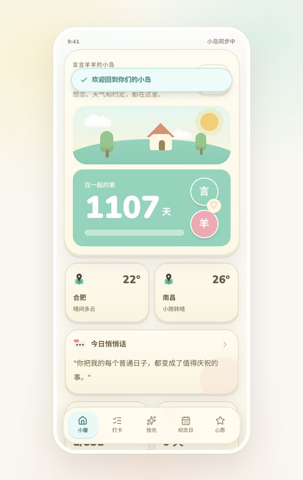
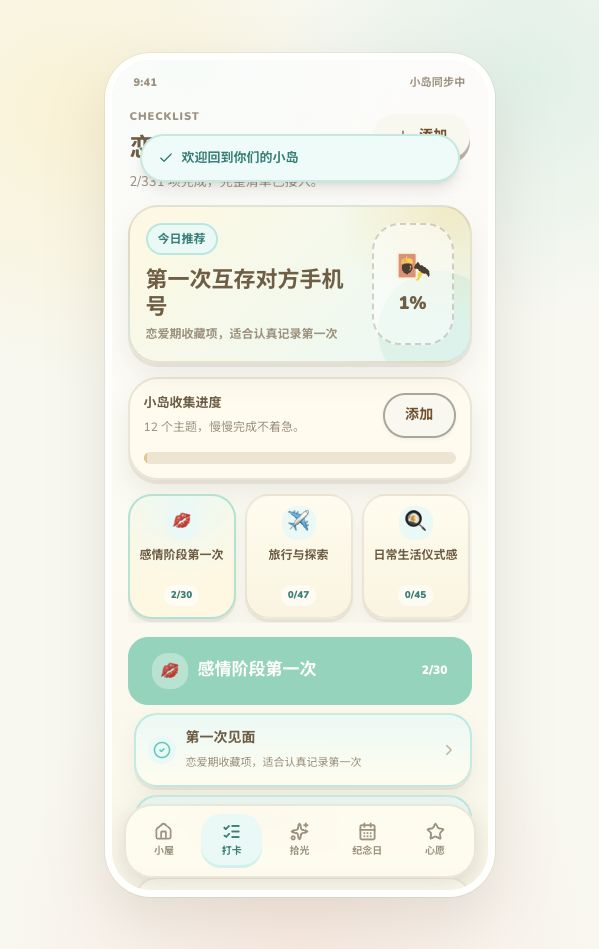
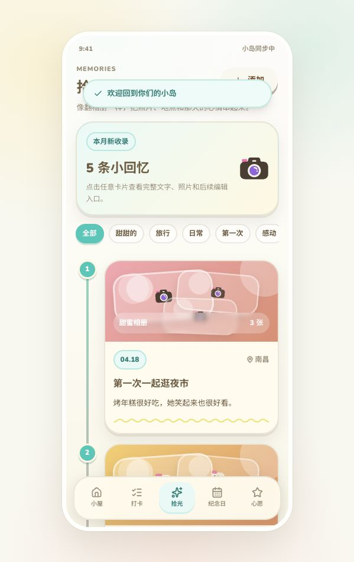
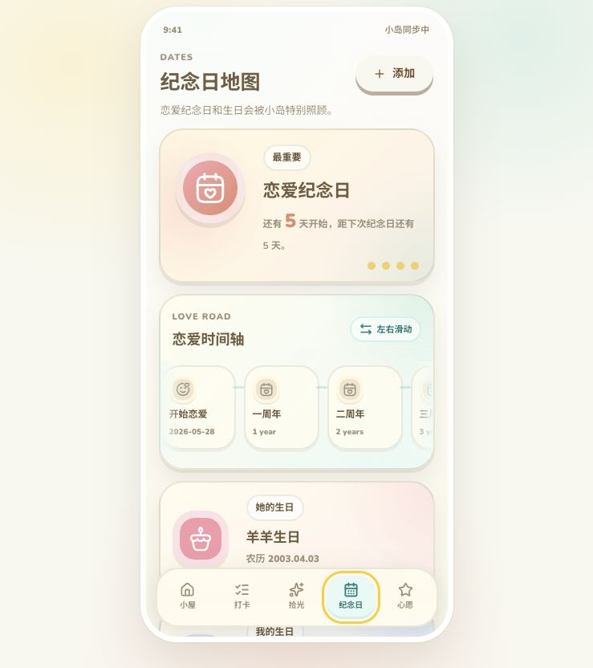
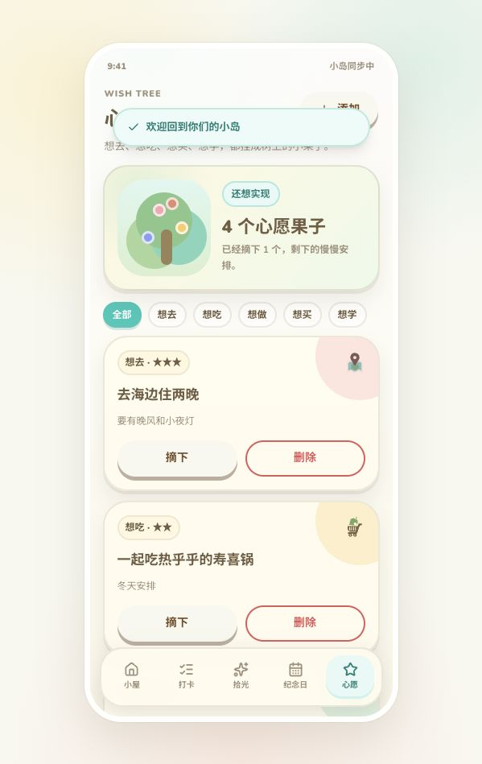
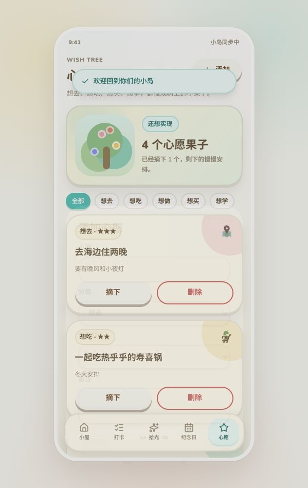
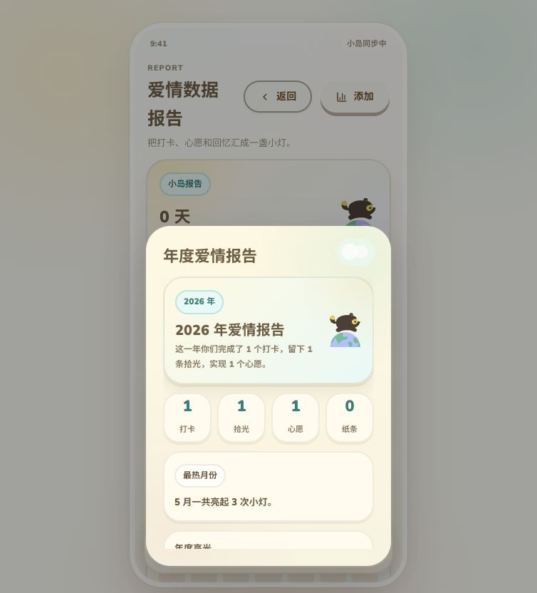

# 言言羊羊的小岛

一个清新可爱的情侣小岛 PWA 前端原型。当前版本以 Animal Island 风格为主，覆盖首页、打卡、拾光、纪念日、心愿树、悄悄话、统计、设置和各类手机弹窗，为后续接入自有后端做准备。

## 截图

| 首页 | 打卡 | 拾光 |
| --- | --- | --- |
|  |  |  |

| 纪念日 | 心愿树 | 添加心愿 |
| --- | --- | --- |
|  |  |  |

| 年度报告 |
| --- |
|  |

## 当前功能

- 小屋首页：在一起天数、天气、悄悄话、打卡进度、下个纪念日。
- 恋爱打卡：接入 `src/data/checkin-items.ts` 的完整清单，支持按主题查看和添加自定义打卡项。
- 拾光时间线：图文相册式时间轴，支持分类筛选和详情弹窗。
- 纪念日地图：重点展示恋爱纪念日、双方生日、恋爱时间轴，并预留求婚、订婚、结婚等节点。
- 心愿树：心愿分类筛选、完成确认、已实现区域。
- 悄悄话：即时/定时/纪念日打开的小纸条原型。
- 统计与设置：真实年度报告、热力图、参与度、邀请、档案和通知设置。

## 技术栈

- React 18
- TypeScript
- Vite
- Tailwind CSS
- animal-island-ui
- lucide-react
- Hugeicons

## 本地开发

```bash
npm install
npm run dev
```

默认访问：

```text
http://127.0.0.1:5173/
```

构建与检查：

```bash
npm run lint
npm run build
```

## 工程结构

```text
src/
  App.tsx                         # 当前原型主页面和弹窗
  components/feedback/            # Loading、Toast、Confirm 等反馈组件
  data/checkin-items.ts            # 331 条打卡清单
  data/mock/loveMock.ts           # 前端 mock 数据
  services/loveApi.ts             # API 抽象层，后续替换为真实后端
  types/love.ts                   # 业务类型
docs/
  product-api-guide.md            # 产品与接口接入说明
  backend-roadmap.md              # 自有服务器后端路线
  screenshots/                    # 当前封存截图
```

## 后端接入方向

当前前端通过 `LoveAppApi` 抽象访问数据，真实接入时建议新增一个自有服务器 API 实现，不让 UI 直接依赖数据库或云服务 SDK。

推荐后端栈：

- Node.js + Fastify 或 NestJS
- PostgreSQL + Prisma
- Redis 可选，用于验证码、限流、会话缓存
- 对象存储：MinIO、阿里 OSS、腾讯 COS 或 Cloudflare R2
- REST 先行，后续按需增加 WebSocket/SSE

更完整的计划见 [docs/backend-roadmap.md](docs/backend-roadmap.md)。

## 版本

- `v0.1.0-animal-island-frontend`：Animal Island 风格前端封存版。
